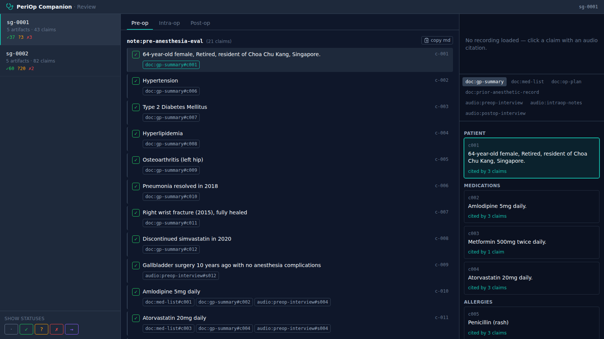

# PeriOp Companion

An agentic peri-operative documentation assistant for anesthesia providers,
built on the NVIDIA Ambient Provider blueprint, orchestrated with **Google
ADK**, instrumented and evaluated with the **NVIDIA NeMo Agent Toolkit (NAT)**,
and grounded in Singapore demographics via **Nemotron-Personas-Singapore**.

**Every claim in every generated note carries provenance** to either a source
record chunk or a timestamped, diarized audio segment. Clinicians will not
trust — and sovereign-health regulators will not accept — generated notes that
cannot show their work.

> Reference/demonstration project. All data is **synthetic, no PHI**.
> Documentation-support tool only; **not a medical device** and not a clinical
> decision-making system.

See [specs/v1.md](specs/v1.md) for the full specification and
[docs/progress.md](docs/progress.md) for build status.

## The problem in one sentence

Three phases (pre-op, intra-op, post-op), scattered truth (documents + audio),
and trust that requires provenance.

## What it does

PeriOp Companion follows one patient through all three phases, generating
stage-appropriate documentation where each statement is traceable:

- **Pre-op** — ingests prior records, runs a **GapAnalyst** that flags what to
  clarify (missing / stale / conflicting, each citing the triggering chunk),
  transcribes the diarized interview, writes a claim-structured
  **pre-anesthesia note** aligning each generated question to the interview
  segments that answered it, and **verifies** every claim against its cited
  spans.
- **Intra-op** — transcribes the anesthetist's voice notes, extracts structured
  events (**Nemotron Nano first pass → Super verification**), writes the
  chronological record, and anticipates post-op issues with provenance spanning
  *both* stages.
- **Post-op** — composes a **PACU handoff** from existing claims only (the
  `HandoffComposer` may select/order/rephrase but never introduce a new claim —
  provenance is inherited), plus a post-anesthesia evaluation note.

## Architecture

```
┌─────────────────────────────────────────────────────────────┐
│  Review UI — React SPA (ui/) + FastAPI layer (periop.api)   │
├─────────────────────────────────────────────────────────────┤
│  NeMo Agent Toolkit — observability & evaluation            │
│  • nat run / serve / eval   • OTel traces   • token/latency │
│  • custom provenance evaluators (evals/)                    │
├─────────────────────────────────────────────────────────────┤
│  Google ADK — agent orchestration                           │
│  • stages as SequentialAgent    • session state = the Case  │
├─────────────────────────────────────────────────────────────┤
│  NVIDIA NIMs (hosted via build.nvidia.com by default)       │
│  • ASR: Parakeet 1.1B + Silero VAD + Sortformer diarization │
│  • Reasoning: llama-3.3-nemotron-super-49b-v1.5             │
│  • Fast: nemotron-nano-9b-v2   • TTS: Magpie (synth only)   │
├─────────────────────────────────────────────────────────────┤
│  Storage: local JSON case store + audio artifacts           │
└─────────────────────────────────────────────────────────────┘
```

**Design rule:** ADK owns orchestration, NAT owns observability and evaluation.
Stages are `SequentialAgent` compositions of `LlmAgent` generate→validate
steps (`LoopAgent` retries with validation-error feedback), the independent
post-op writers run under a `ParallelAgent`, claim verification fans out in
bounded parallel batches, and the Case travels in ADK session state — see
[docs/adk-orchestration.md](docs/adk-orchestration.md).
See [docs/provenance-design.md](docs/provenance-design.md) for how provenance is
made structural, and [docs/attribution.md](docs/attribution.md) for what was
reused from the blueprint versus built.

## Quickstart

```bash
uv sync                 # Python 3.12 environment
uv run pytest           # run the test suite (no network)
```

Live runs need an NVIDIA API key (`NGC_API_KEY` in `.env`). No GPU required —
the default path uses hosted NIMs on build.nvidia.com.

```bash
# smoke-test the model tiers
uv run python scripts/smoke_llm.py

# generate synthetic case bundles (resumable; re-run after rate limits)
uv run python scripts/fetch_personas.py
uv run python scripts/generate_cases.py --n 5

# run one case end-to-end and print every claim with provenance
uv run python -m periop.cli.run_case sg-0001

# or drive it through NAT (ADK pipeline + profiler/traces)
uv run nat run --config_file configs/workflow.yml --input sg-0001

# evaluate against gold
uv run python scripts/run_eval.py

# render the HTML review page for processed cases (offline)
uv run python scripts/render_review.py sg-0002

# review UI (offline): build the SPA once, then serve UI + API in one process
(cd ui && npm install && npm run build)
uv run python -m periop.api            # → http://localhost:8000
```

The server loads `.env` itself, so the `PERIOP_*` endpoint variables apply to
live generation too. If a local NIM already holds port 8000 (the reasoning
NIM in `configs/selfhosted.env` does), move the API:

```bash
PERIOP_API_PORT=8080 uv run python -m periop.api    # → http://localhost:8080
PERIOP_API_PORT=8080 npm run dev                    # (in ui/) proxy follows
```

The entry point warns at startup when a chat-tier URL points back at the
API's own port — that misconfiguration would otherwise make the server call
itself on submit.

### Self-hosted NIMs (no API key, no rate limits)

The same code runs against locally deployed NIMs — endpoint selection is
environment-driven (`PERIOP_*_BASE_URL` variables, see `src/periop/nim.py`
and spec §8.1). With all four NIMs on one GPU box:

```bash
set -a; source configs/selfhosted.env; set +a   # edit host/ports to taste
uv run python scripts/smoke_llm.py               # same commands as above
```

Reference deployment (all four NIMs co-tenant on a single DGX Spark GB10,
120 GB unified memory) is documented in `docs/selfhosted.md`.

## Provenance, made tangible

Each claim renders with its status and cited span — for audio, the speaker and
`(t0, t1)` so a reviewer knows which clip to play:

```
✓ (supported) Metformin discontinued approximately one year ago per patient report.
    ↳ [doc:med-list#c002] [Current Medications] "Metformin 500mg twice daily."
    ↳ [audio:preop-interview#s004] (PATIENT, 37.6-43.6s) "…but metformin, stopped
       already one year plus."
    ↳ [audio:preop-interview#s006] (PATIENT, 47.6-56.0s) "…HbA1c last check was
       6.2%, so doctor say can stop metformin."
```

The records still list metformin as current; the GapAnalyst catches the
conflict, and the note states the interview truth and cites it.

The same ledger drives the **review UI** ([specs/ui.md](specs/ui.md)) — a
three-column workspace with the case list, the claim ledger grouped by stage,
and a provenance panel (documents ⟷ diarized transcripts) with an audio
player:



- Click a claim (or a provenance chip): a document citation highlights the
  exact chunk; an audio citation **plays the exact clip** (`t0`→`t1`,
  auto-pause) from the cited recording while the transcript follows along.
- The reverse index ("cited by *n* claims") walks from any chunk/segment back
  to every claim citing it — a segment cited by both a `supported` and a
  `conflicting` claim is the record-vs-patient story made legible.
- No rendered wavs (they are gitignored)? The UI degrades to timestamp-only
  mode; regenerate audio with `scripts/render_audio.py`.
- Dev loop: `uv run uvicorn periop.api.app:app --reload` + `cd ui && npm run
  dev`. Tests: `npm test` (vitest) and `npm run test:e2e` (Playwright,
  headless, hermetic fixture store — no network).

For zero-dependency review there is still the self-contained static page
([`data/cases/_out/sg-0002.html`](data/cases/_out/sg-0002.html), no server
needed): claims grouped by artifact with unsupported/conflicting ones
visually flagged, each expandable to its cited spans, and every citation
linking into a source-registry section.

## Provider workflow (v2)

[specs/v2.md](specs/v2.md) wraps the same pipeline in a **live clinical
workflow**: providers create cases from the browser and feed each stage its
inputs at the point of care, instead of reviewing pre-baked bundles.

- **Case lifecycle** — created → pre-op → intra-op → post-op → closed, each
  stage the same shape: *inputs → generate → review → sign off*. Per-stage
  status, provider attribution (`performed_by`, `signed_off_by`), and
  timestamps live in an additive `workflow` block; every pre-v2 case JSON
  loads unchanged and renders read-only ("Review only").
- **Intake** — paste or upload (`.txt`/`.md`/`.pdf`) prior records and the op
  plan into typed slots; the **GapAnalyst runs at intake** (it needs no
  audio) as a background generation — uploads return as soon as the document
  is durable, the intake screen polls until the questions arrive, and a
  failed analysis retries from the next upload or an explicit re-run
  ([specs/v2-speed.md](specs/v2-speed.md) §3.2). The questions, each citing
  the triggering chunk, go through a human review — dismiss / reword / add —
  before the interview. Dismissals are kept: a dismissed question that later
  proves relevant is a finding.
- **Audio capture** — in-browser recording (MediaRecorder) or file upload for
  the interview, intra-op voice memos (append-style), and the post-op
  interview; the server normalizes everything to 16 kHz mono wav (ffmpeg,
  with a wav passthrough fallback) so ASR and clip playback work unchanged.
- **Stage runs stream progress** — `POST /stages/{stage}/run` returns SSE
  (per-agent start/end, artifact completion) read with fetch +
  ReadableStream; gates return 409s that name the next action ("sign off the
  preop stage before…"). One run at a time per server.
- **Handoff acknowledge** — the receiving provider opens the SBAR handoff,
  plays any cited clip, and acknowledges receipt; the case records who and
  when. Not a signature — a demonstration of a transfer that is *received,
  traceable, acknowledged*.
- **Worklist** — the sidebar shows every case's headline stage + status in
  plain words, who acted last, and conflict indicators, filterable by stage
  and status. One primary action per case state (unit-tested): a provider who
  only ever presses the big button completes the whole workflow.
- **Conformance** — a pytest walks a synthetic case through the entire API
  workflow and asserts the resulting ledger is identical to the batch
  pipeline's ([tests/test_lifecycle_conformance.py](tests/test_lifecycle_conformance.py)):
  the workflow layer is a re-plumbing, not a fork.
- Hermetic Playwright e2e drives all of it — three provider identities, one
  case, creation to acknowledged handoff — against the real server with an
  instant stub runner (`PERIOP_STUB_RUNNER=1`). A recorded run:
  [docs/images/provider-workflow-demo.webm](docs/images/provider-workflow-demo.webm).

The v2 stretch list shipped too:

- **Live intra-op dictation** — the theatre screen is dictation-first: mic
  audio downsamples to 16 kHz PCM16 in the browser and streams up
  `WS /api/cases/{id}/sources/audio/stream`; partial/final words render as
  they are spoken (Parakeet *streaming* profile live, injectable fake in
  tests), and stop lands citable segments with wav-offset times so
  click-to-play provenance works unchanged. Mic, socket, or ASR failure
  degrades to the memo recorder in words — dictation is never the only way
  through the stage. Live smoke:
  `uv run python scripts/smoke_stream_asr.py`.
- **Per-claim review actions** — quiet *Mark reviewed / Flag* toggles on
  live-case claim rows, persisted as sidecar state
  (`_out/<case_id>.review.json`) so the pipeline-written case JSON stays
  byte-identical; reviewed counts and reviewer-flagged claims feed the
  sign-off summary and jump list.
- **Department dashboard + "my cases"** — one screen answering "where is
  every case, and what needs a reviewer": stage columns with status counts
  in words, a waiting-for-a-reviewer queue naming who generated each output,
  outstanding-conflict totals; plus a worklist filter for cases the picked
  provider has touched.
- **Tablet-width layout** — below desktop width the provenance rail hides
  and the worklist folds into a drawer behind a labelled *Cases* button, so
  the intra-op capture screen is one big column (asserted at iPad viewport
  in e2e).

Build status: [docs/progress-v2.md](docs/progress-v2.md).

## Synthetic data & sovereign-AI grounding

No real patients. Synthetic patients are sampled from
Nemotron-Personas-Singapore (stratified across age band × sex), each assigned a
surgery, comorbidity bundle, medication list, a **deliberate documentation
defect** (missing allergy / stale med list / record-patient conflict), and
**distractor history** (resolved/irrelevant items). The defect makes the
GapAnalyst evaluable (gold = "these questions should have been asked"); the
distractors make relevance judgment evaluable (they must not surface in notes).

## Evaluation

Custom metrics in [`src/periop/evals/`](src/periop/evals/): provenance
precision/coverage, claim recall vs gold, hallucinated-claim rate,
gap-analysis P/R, distractor leakage, structured-extraction F1, clinical-term
KER. A/B experiments: word boosting on/off, **Nano vs Super for extraction**,
constrained vs free-generation handoff. See
[`evals/report.json`](evals/) for the committed run.

## Profiling (NAT-traced live run)

`nat eval --config_file configs/profile_config.yml` runs the full pipeline
with the NAT profiler collecting every LLM call (NimChat emits
LLM_START/LLM_END intermediate steps with token usage, since the ADK plugin
only hooks litellm). Committed reports from one full case (sg-0001, hosted
NIMs on build.nvidia.com) live in [`evals/profile/`](evals/profile/):

| | Nemotron Super 49B (reasoning) | Nemotron Nano 9B (fast) |
|---|---|---|
| Calls | 7 | 44 |
| Role | note generation, gap analysis, event verification | per-claim verification, extraction first pass |
| Avg latency / call | 85.4 s | 8.1 s |
| p95 latency | 171.5 s | 17.3 s |
| Tokens (prompt + completion) | 12,833 + 16,251 | 17,717 + 15,814 |

Full case wall-clock: ~16 min, sequential. The bottleneck report
(`workflow_profiling_report.txt`) confirms the model-tiering story from
spec §8: Super's reasoning latency dominates (bottleneck score 85.4 vs 8.1),
while Nano absorbs 86% of the calls at ~10× lower per-call latency — which is
exactly why verification and the extraction first pass run on the fast tier.

## Observability (Langfuse, live and batch alike)

The provider-facing path is observed exactly like the batch path
([specs/v2-nat.md](specs/v2-nat.md)): every stage run triggered from the
browser executes inside a real NAT `Runner`, so the same
`LLM_START`/`LLM_END` steps the profiler consumes also export as OTel spans.
Tracing is opt-in by environment — set `LANGFUSE_PUBLIC_KEY`,
`LANGFUSE_SECRET_KEY`, and `LANGFUSE_BASE_URL` and both `nat run`/`nat eval`
and the API server export to the same Langfuse project; leave any unset and
the app runs normally after one startup warning (the committed configs'
`_type: periop_langfuse` block is non-secret and inert without credentials).

The committed parity artifact
([`evals/traces/live-preop-trace.json`](evals/traces/live-preop-trace.json),
produced by `scripts/smoke_live_trace.py`) is one live, API-driven pre-op
stage run — `POST /api/cases/{id}/stages/preop/run` against self-hosted
NIMs — fetched back out of Langfuse: 18 observations in one trace, the
`WORKFLOW` bracket plus one Super-49B `GENERATION` (the note writer,
1,911 → 2,183 tokens) and 15 Nano-9B `GENERATION`s (per-claim verification,
~1.5 s each) — the batch profiler's tiering table, visible per-click on the
live path.

## Status

M0–M6 implemented (schemas, three-stage ADK/NAT pipeline, synthetic-data
pipeline, all agents, eval harness, NAT-profiled live run, self-hosted NIM
path with TTS+ASR). The review UI ([specs/ui.md](specs/ui.md), U0–U2+U4 —
see [docs/progress-ui.md](docs/progress-ui.md)) ships the claim ledger with
click-to-play audio provenance. The v2 provider workflow
([specs/v2.md](specs/v2.md), W0–W8 — see
[docs/progress-v2.md](docs/progress-v2.md)) adds the write path: case
creation, staged intake with question review, audio capture, SSE-streamed
stage runs (promoting ui.md's U3 from stretch to shipped), sign-off/reopen,
and handoff acknowledge, pinned to the batch pipeline by a lifecycle
conformance test — plus the full stretch list: live intra-op dictation over
the Parakeet streaming profile, per-claim review actions, the department
dashboard with a "my cases" filter, and the tablet layout. W8
([specs/v2-nat.md](specs/v2-nat.md)) closes the observability gap: live
stage runs execute inside a NAT `Runner` and export to Langfuse when the
environment provides credentials. Remaining:
broader eval dataset (30 cases). Live NIM paths (LLM tiers,
full case runs, traced profiling) are exercised with an NGC key; the ASR/TTS
speech NIMs use documented hosted NVCF endpoints (see
[docs/attribution.md](docs/attribution.md)).
