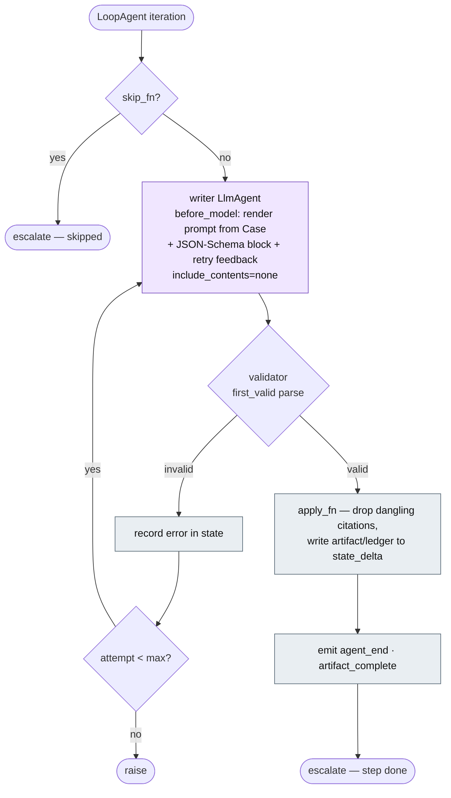

# ADK-native orchestration

The mechanics of the `periop.adk` package — the layer
[architecture.md](architecture.md) §1/§2 maps as "ADK owns orchestration."
This doc is the *how*: the reusable generate→validate cell, the ADK↔NIM model
adapters, the verifier fan-out, and the synchronous seam that keeps the write
API, CLI, batch pipeline, and evals driving the same agents. It does not repeat
the agent roster or the stage flow — those live in architecture §2.

The original implementation wrapped three monolithic stage functions in custom
`BaseAgent`s: ADK was a pass-through shell around code that did its own
sequencing, LLM calls, and retries. This is now *actually* ADK (spec §3.1:
"stage pipelines as SequentialAgent/LlmAgent compositions, session state = the
Case"). `periop.agents` keeps the prompts, schemas, and apply logic plus thin
facades; every one of them executes through the agents built here.

## The composition — literal ADK tree

Architecture §2 is the *flow* view (who reads what); this is the *structural*
view — which ADK agent class wraps which ([stages.py](../src/periop/adk/stages.py)):

```
periop_pipeline (SequentialAgent)                          build_case_pipeline
├── preop_stage (SequentialAgent)
│   ├── record_ingestor        RecordIngestor      det.   records → document sources
│   ├── gap_analyst            LoopAgent                  skip_fn no-ops when questions exist (v2 §4.1)
│   ├── interview_transcriber  Transcriber         det.   diarized pre-op audio source
│   ├── preop_note_block       SequentialAgent            (just preop_note if the chat can't tool-call)
│   │   ├── preop_note         LoopAgent
│   │   └── equipment_advisor  LlmAgent (tools)           native ADK tool loop, fast tier
│   ├── preop_verifier         ClaimVerifierAgent         fan-out
│   └── preop_artifacts        EmitArtifacts       det.   artifact_complete SSE
├── intraop_stage (SequentialAgent)
│   ├── voice_note_transcriber Transcriber
│   ├── event_first_pass       LoopAgent                  Nano first pass (spec §8 tiering)
│   ├── event_verify           LoopAgent                  Super pass — only if PERIOP_EXTRACT_VERIFY (default off)
│   ├── intraop_record         LoopAgent
│   ├── issue_anticipator      LoopAgent
│   ├── intraop_verifier       ClaimVerifierAgent × 2     record, issues (forward-looking)
│   └── intraop_artifacts      EmitArtifacts
└── postop_stage (SequentialAgent)
    ├── postop_transcriber     Transcriber
    ├── postop_writers         ParallelAgent              handoff ∥ postop_eval — both park artifacts
    ├── postop_ledger          AppendArtifacts            commits handoff-first
    └── postop_verifier        ClaimVerifierAgent × 2
```

Deterministic nodes (`RecordIngestor`, `Transcriber`, `AppendArtifacts`,
`EmitArtifacts`) are custom `BaseAgent`s whose only effect is a `state_delta`
on the Case ([deterministic.py](../src/periop/adk/deterministic.py)); they sit
at a fixed point of the sequence rather than running at a model's discretion.

## The structured step (`adk.steps.structured_step`)

Every LLM node of the spec — writers, gap analysis, event passes, each
per-claim verdict — is one generate→validate `LoopAgent`, whose iterations
*are* the structured-output retries ([steps.py:125](../src/periop/adk/steps.py)):



- The **writer** `LlmAgent` renders its user message from the Case in session
  state in a `before_model_callback`, appends the same JSON-Schema instruction
  block `NimChat.complete_structured` used, and — via `include_contents="none"`
  plus an explicit system instruction — sends *exactly one user turn*, keeping
  the session transcript and ADK's identity boilerplate out of the request. So
  live prompts are byte-identical to the pre-ADK pipeline.
- The **validator** (`StructuredValidator`) parses the reply with the same
  candidate-scanning extraction (`nim.first_valid`), runs the step's `apply_fn`
  (citation filtering, ledger writes), and `escalate`s out of the loop. On a
  parse/validation failure it records the error in state; the next iteration's
  writer prompt carries the rejected reply + error as corrective feedback
  (`retry_feedback`). Exhausting `max_attempts` (3) raises, exactly as
  `complete_structured` did.
- `skip_fn` short-circuits the whole step before any model call (gap analysis
  when questions already exist); `announce_start`/`announce_end` and
  `artifact_state_key` drive the SSE brackets (ui.md §7).

## Model adapters (`adk.model`)

Two `BaseLlm` adapters plug the NIM tiers into ADK's model layer, so
`LlmAgent` steps drive the same endpoint-resolved (`PERIOP_*`),
`/no_think`-configured, NAT-traced clients as before ([model.py](../src/periop/adk/model.py)):

- **`ChatModel`** — for the structured steps. The live path calls
  `NimChat.complete` (the prompt already embeds the schema; the validator does
  the parse). A test double that implements only `complete_structured` (the
  historical stub seam) is honored by a fallback that serializes its pydantic
  result back to JSON text — both paths hit the same validator and apply logic.
- **`ToolChatModel`** — for the two tool-calling agents (EquipmentAdvisor and
  CaseChat). It marshals the whole ADK conversation (text, `function_call`,
  `function_response` parts) to the NIM's OpenAI-compatible `tools` interface
  and maps `tool_calls` replies back into genai `function_call` parts,
  preserving `tool_call_id` pairing — so a plain `LlmAgent` with Python
  function tools runs its native tool loop against the fast tier. The
  EquipmentAdvisor rides on the pre-op note step as a sub-`SequentialAgent`,
  present only when the injected chat speaks `complete_chat`
  ([stages.py:57](../src/periop/adk/stages.py)).

## Claim verification (`adk.verifier.ClaimVerifierAgent`)

Verdicts are independent, so the agent seeds every claim's input (text +
rendered spans) in one `state_delta`, builds one verdict `structured_step` per
claim (each with its own state keys, so branches never contend), and runs them
in dynamically-built `ParallelAgent` batches of width
`PERIOP_VERIFIER_CONCURRENCY` (default 4; `0`/`1` = sequential, the knob for
rate-limited hosted endpoints). It then re-reads the authoritative Case and
flags each `claim.status` in place — never dropping — in original ledger order
([verifier.py](../src/periop/adk/verifier.py)).

## The synchronous seam (`adk.runtime`)

`run_agent(agent, case, emit_fn)` is the Case → Case bridge every non-ADK
caller uses; the stage facades (`run_preop/intraop/postop_stage`,
[preop_stage.py](../src/periop/agents/preop_stage.py)) and the single-step
facades (`GapAnalyst`, `PreOpNoteWriter`, `EventExtractor`, `ClaimVerifier`, …)
all funnel through it, so intake gap analysis and the A/B eval arms execute
through the *same* agents as the full pipeline ([runtime.py](../src/periop/adk/runtime.py)):

- **Loop-safe.** Normally called from a loop-less thread (the NAT function runs
  the stage in `asyncio.to_thread`, v2-nat §3.1) and runs the pipeline there.
  Under an already-running loop (sync callers inside a coroutine — tests) it
  moves the run to a one-off worker thread with the caller's context copied.
  Either way NAT's step stream is reached: off-loop LLM pushes marshal to the
  bound export loop so their spans still land in Langfuse.
- **Error unwrapping.** A failed `ParallelAgent` branch surfaces as an
  `ExceptionGroup`; `run_agent` reduces it to the underlying leaf error (e.g.
  the reasoning NIM's `RuntimeError`) that sync callers expect.
- **SSE bridge.** Progress flows through a `contextvar` (`_EMIT`), not session
  state — it is per-request plumbing, not case data, and contextvars propagate
  through the asyncio tasks ADK spawns (including `ParallelAgent` branches and
  `asyncio.to_thread`). Step callbacks emit the same
  `agent_start`/`agent_end`/`artifact_complete` protocol, in the same order, as
  the old stage functions.
- **Case round-trip.** The runner carries the Case through session state as
  JSON; `sync_case` copies the result's fields back onto the caller's Case
  instance, so the mutate-in-place contract the stage functions always had
  still holds.

These seams are pinned by the [conformance tests](../tests/test_lifecycle_conformance.py):
CLI == API == batch produce an identical ledger.
