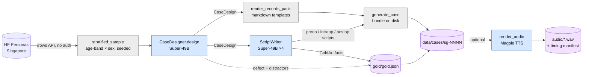
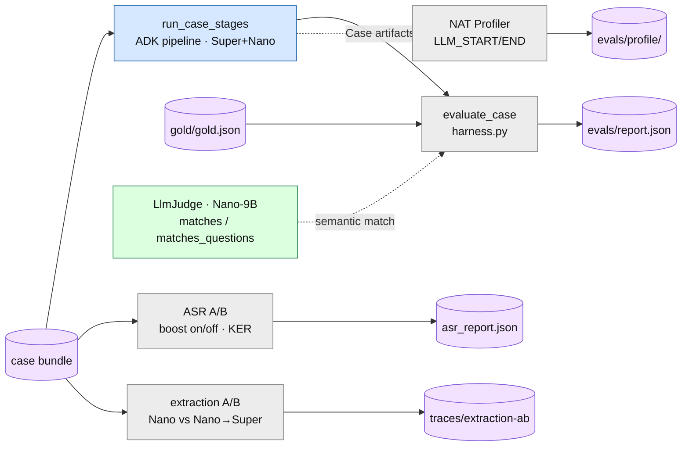

# Architecture overview

A map of PeriOp Companion for anyone extending it. It follows one patient
through three perioperative stages (pre-op → intra-op → post-op) and generates
stage-appropriate documentation where **every claim carries provenance** to a
source chunk or a diarized audio segment. This doc is the skeleton and the
seams, with two diagrams — the **system architecture** and the **agent
handoffs** — backed by component tables. Deeper treatments are linked inline.

Companion docs: [adk-orchestration.md](adk-orchestration.md) ·
[provenance-design.md](provenance-design.md) · [attribution.md](attribution.md)
· [selfhosted.md](selfhosted.md).

## The one principle

**ADK owns orchestration. NAT owns observability and evaluation. The `Case`
is the single source of truth.** Agents are ADK compositions; every LLM/tool
call lands in a NAT trace; the batch pipeline and the live provider workflow
mutate the *same* `Case` through the *same* stage agents (pinned by
[conformance tests](../tests/test_lifecycle_conformance.py)).

---

## 1. System architecture

Six planes: **Application** (the three ways in), **Backend** (FastAPI +
in-process ADK orchestration), **Model** (env-selected NIM tiers), **Data**
(on-disk JSON + audio), and two offline paths — **Synthetic Generation** (builds
the case bundles + gold labels) and **Evaluation** (scores the pipeline against
that gold).

```mermaid
flowchart TB
    classDef app fill:#e8f0ff,stroke:#3b6cb0,color:#111
    classDef be fill:#eef7ee,stroke:#3a7a3a,color:#111
    classDef orch fill:#fff4d6,stroke:#b7791f,color:#111
    classDef mdl fill:#f0e6ff,stroke:#7a4fbf,color:#111
    classDef dat fill:#e9eef2,stroke:#5a6b78,color:#111
    classDef off fill:#fde8ee,stroke:#b03a5b,color:#111

    subgraph L1["① Application — three ways in"]
        direction LR
        spa["React SPA<br/>ui/"]:::app
        cli["Terminal CLI<br/>periop"]:::app
        skill["Agent Skill<br/>.agents/"]:::app
        spa ~~~ cli ~~~ skill
    end

    subgraph L2["② Backend — FastAPI, one process"]
        direction TB
        api["API routers — REST · SSE · WS"]:::be
        gapw["Gap Worker<br/>background intake analysis"]:::be
        transw["ASR Worker<br/>background transcription"]:::be
        subgraph GEN["Generation — serialized by the Run Lock, hosted &amp; traced by NAT"]
            direction TB
            nat["NAT Session"]:::be
            subgraph ORCH["ADK Orchestration"]
                direction LR
                pipeline["Stage Pipeline<br/>Sequential/Loop/Parallel"]:::orch
                verifier["ClaimVerifier<br/>fan-out"]:::orch
                chat["CaseChat<br/>tools"]:::orch
                pipeline ~~~ verifier ~~~ chat
            end
            nat --> ORCH
        end
        api ==>|"stage run"| GEN
        gapw ==>|"gap analysis"| GEN
        api -.->|launch| gapw
        api -.->|launch| transw
    end

    subgraph OFF["Offline paths — build &amp; measure"]
        direction TB
        subgraph SYN["Synthetic Generation — builds cases + gold"]
            direction LR
            sy1["personas<br/>(HF, seeded)"]:::off
            sy2["Case Designer<br/>Super-49B"]:::off
            sy3["Script Writer<br/>+ gold"]:::off
            sy1 --> sy2 --> sy3
        end
        subgraph EVALP["Evaluation — scores vs gold"]
            direction LR
            ev1["run pipeline"]:::off
            ev2["metrics + LLM judge"]:::off
            ev3["report.json"]:::off
            ev1 --> ev2 --> ev3
        end
        SYN ~~~ EVALP
    end

    subgraph L3["③ Model — NVIDIA NIMs, env-selected"]
        direction LR
        super["Super-49B<br/>reasoning"]:::mdl
        nano["Nano-9B<br/>fast"]:::mdl
        asr["Parakeet<br/>ASR"]:::mdl
        tts["Magpie<br/>TTS"]:::mdl
        super ~~~ nano ~~~ asr ~~~ tts
    end

    subgraph L4["④ Data — on-disk, atomic"]
        direction LR
        store[("Case JSON<br/>store")]:::dat
        wav[("Audio<br/>WAVs")]:::dat
        sidecar[("Review<br/>sidecar")]:::dat
        equip[("Equipment<br/>ledger")]:::dat
        bundle[("Case<br/>bundles")]:::dat
        store ~~~ wav ~~~ sidecar ~~~ equip ~~~ bundle
    end

    L1 ==>|"HTTP /api"| L2
    L2 ==>|"NIM calls"| L3
    transw ==>|"direct Parakeet · no lock, no NAT"| asr
    L2 ==>|"persist / read"| L4
    SYN ==>|"writes bundles + gold"| L4
    SYN -.->|"design + scripts"| L3
    EVALP ==>|"reads case + gold"| L4
    EVALP -.->|"judge · profiler"| L3
```

> A layered view — the bands are the planes, the bold arrows are the cross-plane
> dependencies; the per-plane detail is in the tables below. The two offline
> paths (Synthetic Generation, Evaluation) have their own detailed diagrams
> further down.

### Application — the three ways in ([ui/](../ui/), [cli/](../src/periop/cli/), [.agents/](../.agents/))

| Component | What it is | Reference |
|---|---|---|
| React SPA | Single-file-routed React 18 + Vite + Tailwind; state in `App.tsx`, view-models in `lib/`. Served from `ui/dist` at `/` by FastAPI, so one process is the whole demo. | [ui/src/app/App.tsx](../ui/src/app/App.tsx) |
| Terminal CLI | `periop` — a thin HTTP client over the same `/api`; owns no workflow logic, prints the server's next-action messages verbatim. | [cli/main.py](../src/periop/cli/main.py) |
| Agent Skill | NemoClaw-style skill teaching coding-agent harnesses to drive the workflow. | [.agents/skills/periop-provider-workflow/](../.agents/skills/periop-provider-workflow/) |

All three converge on one HTTP surface; the [conformance tests](../tests/test_cli_conformance.py) assert CLI == API == batch produce an identical ledger.

### Backend — FastAPI + in-process ADK ([src/periop/api/](../src/periop/api/))

| Component | Role | Reference |
|---|---|---|
| API routers | Read-mostly FastAPI. Reads in `cases.py`; the write path (create, upload, question review, sign-off/reopen, handoff ack) in `workflow.py`; SSE generation in `stage_runs.py`; live dictation WebSocket in `stream_asr.py`. | [api/routers/](../src/periop/api/routers/) |
| Run Lock | One process-wide `threading.Lock` — a single generation in flight at a time (a demo tool, not a job queue). Transcription deliberately skips it (different NIM). | [api/run_lock.py](../src/periop/api/run_lock.py) |
| Gap / ASR Workers | Two background daemons with **different** dependencies: the **Gap Worker** takes the run lock and runs the GapAnalyst through the *same NAT + ADK generation path* as a stage run; the **ASR Worker** takes no lock and calls Parakeet directly — independent of NAT/ADK. Both stamp `PENDING → RUNNING → COMPLETE/FAILED` on the case and are swept to `FAILED` at boot if interrupted. | [gap_analysis.py](../src/periop/api/gap_analysis.py) · [transcription.py](../src/periop/api/transcription.py) |
| NAT Session | One long-lived NAT `Runner` per process; each browser-triggered stage run executes inside it via a contextvar bridge, so **live runs trace exactly like batch `nat run`**. | [api/nat_bridge.py](../src/periop/api/nat_bridge.py) |
| Stage Pipeline | The ADK `SequentialAgent` tree — see §2. | [adk/stages.py](../src/periop/adk/stages.py) |
| structured step | The one reusable generate→validate cell every LLM agent is built from (writer `LlmAgent` + validator inside a `LoopAgent`). | [adk/steps.py](../src/periop/adk/steps.py) |
| Case Chat | Standalone tool-calling assistant (not a pipeline node) that answers over the record and orders equipment. | [agents/case_chat.py](../src/periop/agents/case_chat.py) |

### Model — env-selected NIM tiers ([src/periop/nim.py](../src/periop/nim.py))

Endpoints resolve purely from env (`PERIOP_{TIER}_BASE_URL`, `tier_config`
[nim.py:42](../src/periop/nim.py)), so the same code runs against hosted NIMs
(build.nvidia.com) or self-hosted NIMs with no change. `/no_think` is injected
by default to suppress Nemotron reasoning tokens (the measured latency
bottleneck: Super averages ~85 s/call vs Nano ~8 s).

| Tier | Model | Used by |
|---|---|---|
| reasoning | `llama-3.3-nemotron-super-49b-v1.5` | note/record generation, gap analysis, event verify, issue anticipation, handoff, post-op eval |
| fast | `nvidia-nemotron-nano-9b-v2` | claim verification, extraction first pass, equipment advisor, case chat, LLM judge |
| ASR | Parakeet (Riva gRPC) + Sortformer diarization | offline transcription & live dictation ([tools/asr.py](../src/periop/tools/asr.py)) |
| TTS | Magpie | synthetic-audio rendering only ([tools/tts.py](../src/periop/tools/tts.py)) |

### Data — on-disk, atomic ([src/periop/store.py](../src/periop/store.py))

| Store | Contents | Reference |
|---|---|---|
| Case JSON store | One human-readable JSON per case; atomic writes (`os.replace`), `mutate()` under a lock so handlers and background workers compose instead of clobber. | [store.py](../src/periop/store.py) |
| Audio WAVs | 16 kHz mono PCM (ffmpeg-normalized). Intra-op memos accumulate into one growing wav; interviews replace. Served with HTTP Range for clip seeking. | [tools/audio.py](../src/periop/tools/audio.py) · [routers/audio.py](../src/periop/api/routers/audio.py) |
| Review sidecar | `{case_id}.review.json` — reviewer mark/flag actions, kept off the case JSON so the pipeline output stays byte-identical. | [store.py](../src/periop/store.py) |
| Equipment ledger | Reservation ledger (`_equipment/reservations.json`) against a fixed in-code catalog; the only equipment state that persists. | [equipment.py](../src/periop/equipment.py) |
| Case bundles | `data/cases/sg-NNNN/` — the synthetic inputs + gold (below). | [synthgen/bundle.py](../src/periop/synthgen/bundle.py) |

### Synthetic Generation — builds the cases and their gold ([src/periop/synthgen/](../src/periop/synthgen/))

No real patients. A resumable pipeline turns Singapore personas into flawed case
bundles whose *known* defects make the pipeline evaluable.



- **Personas** ([personas.py:44](../src/periop/synthgen/personas.py)) — `nvidia/Nemotron-Personas-Singapore`, stratified age-band × sex, seeded; committed to `data/synthgen/personas_sample.jsonl`. ([scripts/fetch_personas.py](../scripts/fetch_personas.py))
- **Case design** ([case_designer.py:58](../src/periop/synthgen/case_designer.py), Super-49B) — one structured call yields surgery, ASA, comorbidities, meds, **exactly one deliberate defect** (`missing_allergy | stale_med_list | record_patient_conflict`, [design.py:14](../src/periop/synthgen/design.py)) and ≥1 **distractor**. The flawed `RecordView` and the truth differ *only* by the defect.
- **Records pack** ([records.py:80](../src/periop/synthgen/records.py)) — deterministic markdown (stable chunk ids, exact defect placement): `doc:gp-summary`, `doc:med-list`, `doc:op-plan`, optional `doc:prior-anesthetic-record`.
- **Scripts + gold** ([scripts.py:145](../src/periop/synthgen/scripts.py), Super-49B ×4) — diarized pre-op/post-op interviews (a `reveals_truth` gate forces the patient to say the withheld truth, retried once), the intra-op voice-note bundle + gold events, and `GoldArtifacts` (gold pre-op/handoff claims that must exclude distractors).
- **Bundle** ([bundle.py:98](../src/periop/synthgen/bundle.py)) — writes `design.json`, `records/`, `scripts/`, `gold/gold.json`; each piece skipped if present, so a rate-limit interruption just re-runs. Audio is optional via [render_audio.py](../scripts/render_audio.py) (Magpie TTS → wav + gold timing manifest for ASR eval).

The **gold** (`GoldCase`, [bundle.py:40](../src/periop/synthgen/bundle.py)): the defect's `gold_question` (gap analysis must ask), gold events, gold claims, and the distractor list (must *not* surface).

### Evaluation — scores the pipeline against gold ([src/periop/evals/](../src/periop/evals/))



- **Metrics** ([metrics.py](../src/periop/evals/metrics.py)) — provenance coverage/precision, hallucinated-claim rate, claim recall vs gold, gap-analysis P/R, distractor leakage, structured-extraction F1, clinical-term KER, speaker-attribution accuracy. Set metrics take an injected `matches(pred, gold)` predicate.
- **Harness** ([harness.py:44](../src/periop/evals/harness.py)) — scores one `Case` against its `GoldCase`; `aggregate` means across cases. Runner: [scripts/run_eval.py](../scripts/run_eval.py) → `evals/report.json` (resumable).
- **LLM judge** ([judge.py:65](../src/periop/evals/judge.py), Nano-9B) — yes/no, temp 0, cached; a **directional** question-coverage prompt (`matches_questions`) exists because the symmetric fact prompt pinned gap-F1 to 0.
- **A/B** — extraction Nano vs Nano→Super ([ab.py:33](../src/periop/evals/ab.py), the reason `PERIOP_EXTRACT_VERIFY` defaults off); ASR word-boosting on/off ([eval_asr.py](../scripts/eval_asr.py)). Constrained-vs-free handoff is a *design constraint*, not a coded arm.
- **NAT profiler** ([configs/profile_config.yml](../configs/profile_config.yml)) — consumes the `LLM_START/LLM_END` steps `NimChat` emits → `evals/profile/` bottleneck report. Custom metrics are also registered as NAT evaluators in [configs/eval_config.yml](../configs/eval_config.yml).

---

## 2. Agents, tools & handoffs

Every LLM node is a `structured_step` `LoopAgent` (writer + validator, up to 3
retries; [steps.py:125](../src/periop/adk/steps.py)). **The handoff medium is the
`Case` in ADK session state** (key `case`): each agent reads it via `get_case`,
writes a `state_delta`, and the next agent reads the result. The diagram reads
bottom-up: **③ the model tiers**, **② the agents & ASR grouped by the tier they
call** (each in its own colour), and **① the same components** — same colours,
minimal text — arranged as three stacked left-to-right rows: pre-op, intra-op,
post-op, each fed by its **file/audio inputs** (yellow) and gated by its
**provider interactions** (dashed) — [workflow.py](../src/periop/api/routers/workflow.py).

```mermaid
%%{init: {'flowchart': {'rankSpacing': 60, 'nodeSpacing': 35}}}%%
flowchart TB
    classDef det  fill:#e8e8e8,stroke:#777,color:#111
    classDef mdl  fill:#efe6ff,stroke:#6a3fb0,color:#111,font-weight:bold
    classDef cAsr fill:#80b1d3,stroke:#356,color:#111
    classDef cGap fill:#fdb462,stroke:#864,color:#111
    classDef cNote fill:#fb8072,stroke:#833,color:#111
    classDef cEquip fill:#ffed6f,stroke:#883,color:#111
    classDef cExt fill:#b3de69,stroke:#494,color:#111
    classDef cRec fill:#8dd3c7,stroke:#376,color:#111
    classDef cIss fill:#bebada,stroke:#546,color:#111
    classDef cHand fill:#fccde5,stroke:#849,color:#111
    classDef cPae fill:#bc80bd,stroke:#639,color:#111
    classDef cVer fill:#ccebc5,stroke:#484,color:#111
    classDef cChat fill:#ffffb3,stroke:#883,color:#111
    classDef input fill:#fff9db,stroke:#a68b00,color:#111
    classDef user fill:#ffffff,stroke:#333,color:#111,stroke-dasharray: 3 3

    subgraph FLOW["① Orchestration flow — stages run top→bottom; each stage flows left→right; Case in ADK session state is the handoff medium; yellow = file/audio input, dashed = provider interaction"]
        direction TB

        hist[("Case history<br/>docs")]:::input
        audPre[("Pre-op interview<br/>audio")]:::input
        qGate(["Provider reviews &amp;<br/>approves questions"]):::user
        subgraph FPRE["Pre-op"]
            direction LR
            p0["ingest"]:::det --> p1["Gap"]:::cGap --> p2["ASR"]:::cAsr --> p3["Note"]:::cNote --> p4["Equip"]:::cEquip --> p5["Verify"]:::cVer
        end
        hist -.-> p0
        p1 -.-> qGate -.-> p2
        audPre -.-> p2
        signPre(["Provider signs off<br/>(+ reserves equipment)"]):::user
        p5 -.-> signPre

        audIntra[("Intra-op memo<br/>audio")]:::input
        subgraph FINT["Intra-op"]
            direction LR
            i0["ASR"]:::cAsr --> i1["Extract"]:::cExt --> i2["Record"]:::cRec --> i3["Issues"]:::cIss --> i4["Verify"]:::cVer
        end
        audIntra -.-> i0
        signPre -.->|gates| i0
        signIntra(["Provider<br/>signs off"]):::user
        i4 -.-> signIntra

        audPost[("Post-op interview<br/>audio")]:::input
        subgraph FPOST["Post-op"]
            direction LR
            o0["ASR"]:::cAsr --> o1["Handoff"]:::cHand
            o0 --> o2["PostOp eval"]:::cPae
            o1 --> o3["append"]:::det
            o2 --> o3
            o3 --> o4["Verify"]:::cVer
        end
        audPost -.-> o0
        signIntra -.->|gates| o0
        signPost(["Provider<br/>signs off"]):::user
        ack(["Provider acks<br/>handoff"]):::user
        o4 -.-> signPost -.-> ack

        p3 -.->|reads| i3
        i3 -.->|reads| o1
        p3 -.->|reads| o1
        i2 -.->|reads| o1
    end

    subgraph GNANO["② fast-tier agents"]
        direction TB
        subgraph RN1[" "]
            direction LR
            a_ext["EventExtractor<br/>Nano pass → Super verify"]:::cExt ~~~ a_equip["EquipmentAdvisor<br/>suggest tool"]:::cEquip
        end
        subgraph RN2[" "]
            direction LR
            a_ver["ClaimVerifier<br/>NLI fan-out"]:::cVer ~~~ a_chat["CaseChat<br/>7 tools · live UI"]:::cChat
        end
        RN1 ~~~ RN2
    end

    subgraph GSUPER["② reasoning-tier agents"]
        direction TB
        subgraph RS1[" "]
            direction LR
            a_gap["GapAnalyst"]:::cGap ~~~ a_iss["IssueAnticipator<br/>cross-stage"]:::cIss
        end
        subgraph RS2[" "]
            direction LR
            a_note["PreOpNoteWriter"]:::cNote ~~~ a_hand["HandoffComposer<br/>existing claims only"]:::cHand
        end
        subgraph RS3[" "]
            direction LR
            a_rec["IntraOpRecordWriter"]:::cRec ~~~ a_pae["PostAnesthesiaEvaluator"]:::cPae
        end
        RS1 ~~~ RS2 ~~~ RS3
    end

    subgraph GASR["② speech"]
        direction TB
        a_asr["ASR transcribers<br/>diarize · dictation"]:::cAsr
    end

    nano["③ Nano-9B<br/><b>fast tier</b>"]:::mdl
    super["③ Super-49B<br/><b>reasoning tier</b>"]:::mdl
    asr["③ Parakeet<br/><b>ASR</b>"]:::mdl

    GNANO ==> nano
    GSUPER ==> super
    GASR ==> asr

    style RN1 fill:transparent,stroke:transparent
    style RN2 fill:transparent,stroke:transparent
    style RS1 fill:transparent,stroke:transparent
    style RS2 fill:transparent,stroke:transparent
    style RS3 fill:transparent,stroke:transparent

    FLOW ~~~ GNANO
    FLOW ~~~ GSUPER
    FLOW ~~~ GASR
```



**Reading it, bottom-up:** ③ the **model tiers**; ② the **agents & ASR grouped by
the tier they call** — reasoning agents in a 2×3 grid, fast agents 2×2, each in
its own colour, one bold edge per group to its model; and ① those same components
(same colours, minimal text) laid out as **three stacked left-to-right rows** —
pre-op, intra-op, post-op — with the post-op **parallel split** (Handoff ∥
PostOp-eval → append) and dashed **cross-stage reads**. Grey = deterministic steps
(ingest / append). *Magpie TTS appears only in the synthetic-data path (§1) and is
omitted here.*

**Inputs and the provider in the loop.** The yellow nodes are what a provider
actually feeds in — the prior-records pack and, per stage, the
`preop-interview` / `intraop-notes` / `postop-interview` audio
([`AUDIO_KIND_TO_STAGE`](../src/periop/api/routers/workflow.py)) — and the
dashed nodes are where the provider has to act before the pipeline can move
on: **review & approve** the GapAnalyst's questions (gates the ASR/Note leg —
`questions_approved_at` must be set, [stage_runs.py:85](../src/periop/api/routers/stage_runs.py)),
**sign off** each stage (which gates the *next* stage's run —
`PRIOR_STAGE`, same file — and on pre-op also reserves the ticked equipment
suggestions), and finally **acknowledge the handoff**. In the live workflow
Gap analysis and ASR mostly happen ahead of the stage run, in the background
Gap/ASR workers (§1); the pipeline's `Gap`/`ASR` nodes re-run the same
idempotent steps and no-op when their output is already on the `Case`.

### Agent reference

| Agent | Tier | Reads (from Case) | Writes | file |
|---|---|---|---|---|
| RecordIngestor | det. | prior-records pack on disk | `sources` (documents) | [deterministic.py:32](../src/periop/adk/deterministic.py) |
| GapAnalyst | Super-49B | document `sources` | `open_questions` (missing/stale/conflicting, cited) | [gap_analyst.py](../src/periop/agents/gap_analyst.py) |
| InterviewTranscriber | det. (ASR) | `audio:preop-interview` inputs | diarized `sources` (segments) | [deterministic.py:46](../src/periop/adk/deterministic.py) |
| PreOpNoteWriter | Super-49B | all `sources` + active `open_questions` | `note:pre-anesthesia-eval` (dangling citations dropped) | [preop_note.py](../src/periop/agents/preop_note.py) |
| EquipmentAdvisor | Nano-9B (tools) | `doc:op-plan` + the fresh note + catalog | `equipment_suggestions` (≤3) via its tool | [equipment_advisor.py](../src/periop/agents/equipment_advisor.py) |
| EventExtractor (2-pass) | Nano→Super (verify gated off) | audio `sources`; pass-2 reads pass-1 state | state `event_extract__first` → `extracted_events` | [event_extractor.py](../src/periop/agents/event_extractor.py) |
| IntraOpRecordWriter | Super-49B | state `extracted_events` + audio spans | `intraop_events` + `record:intra-op` | [intraop_record.py](../src/periop/agents/intraop_record.py) |
| IssueAnticipator | Super-49B | **pre-op note + intra-op record claims + events + all sources** | `note:anticipated-issues` + `anticipated_issues`; claim-refs inherit provenance | [issue_anticipator.py](../src/periop/agents/issue_anticipator.py) |
| HandoffComposer | Super-49B | **existing claims only** (`artifact_id#claim_id`) | parks `note:pacu-handoff`; inherits provenance, drops items citing no real claim | [handoff.py](../src/periop/agents/handoff.py) |
| PostAnesthesiaEvaluator | Super-49B | all `sources` (post-op interview + prior) | parks `note:post-anesthesia-eval` (new cited claims) | [postop_eval.py](../src/periop/agents/postop_eval.py) |
| AppendArtifacts | det. | parked state keys | commits both artifacts in **fixed order** (handoff first) | [deterministic.py:79](../src/periop/adk/deterministic.py) |
| ClaimVerifier | Nano-9B | one artifact's claims + their cited spans | sets each `claim.status` in place (never drops); forward-looking mode admits `inference` | [verifier.py](../src/periop/adk/verifier.py) |
| CaseChat | Nano-9B (tools) | reloads Case from disk per call | equipment ledger only (pre-op) | [case_chat.py](../src/periop/agents/case_chat.py) |

### Tools

**EquipmentAdvisor** ([equipment_advisor.py:95](../src/periop/agents/equipment_advisor.py)) — one tool, `suggest_equipment(item_id, reason)`: validates against the catalog, upserts into `equipment_suggestions` (≤3). Suggestions only — nothing is reserved until pre-op sign-off.

**CaseChat** ([case_chat.py:374](../src/periop/agents/case_chat.py), 7 tools) — read: `list_sources`, `search_case` (fuzzy over chunks/segments/claims), `read_source`, `list_equipment`, `case_equipment`; write (pre-op only, blocked on demo/signed-off cases): `reserve_equipment`, `release_equipment`. Emits `tool_call`/`tool_result` SSE; capped at 12 LLM calls/turn.

### Four things the diagram encodes

1. **Cross-stage provenance** — IssueAnticipator (intra-op) reads pre-op *and* intra-op artifacts; a claim-ref citation inherits the referenced claim's source provenance.
2. **Composition, not generation, for the handoff** — HandoffComposer may only select/order/rephrase existing signed-off claims and *inherits* their provenance; an item citing no real claim is dropped. Hallucination is bounded in the highest-stakes artifact by construction.
3. **Concurrency decoupled from ledger order** — the two post-op writers run in a `ParallelAgent` and *park* their artifacts; `AppendArtifacts` commits them in a fixed order so the ledger never depends on which finished first. ClaimVerifier likewise fans out per-claim in parallel batches (`PERIOP_VERIFIER_CONCURRENCY`) but writes verdicts back in original order.
4. **The provider is the gate, not a bystander** — a stage cannot generate until the prior one is signed off, and pre-op cannot generate until its questions are reviewed; sign-off is also where pre-op equipment suggestions become real reservations.

---

## 3. The data model — the heart

[`src/periop/schemas.py`](../src/periop/schemas.py) is where the design lives.
Notes are **not prose that gets annotated** — they are stored as claims and
rendered from them, so a claim cannot exist without a citation.

- **`ProvenanceRef`** ([:48](../src/periop/schemas.py)) — a citation `source_id#anchor` (`.parse()` splits on the *final* `#`; ids contain colons, e.g. `audio:preop-interview#s017`).
- **`Source`** ([:109](../src/periop/schemas.py)) — append-only registry entry: `DOCUMENT` (holds `Chunk`s) or `AUDIO` (holds `AudioSegment`s, each `t0,t1,speaker` — this powers click-to-play).
- **`Claim`** ([:134](../src/periop/schemas.py)) + **`ClaimStatus`** ([:29](../src/periop/schemas.py)): `UNVERIFIED → SUPPORTED | UNSUPPORTED | CONFLICTING`, plus `INFERENCE` for forward-looking risk. Flagged claims are surfaced, never dropped.
- **`Case`** ([:304](../src/periop/schemas.py)) — `add_artifact` refuses any claim whose provenance doesn't resolve; `record_human_edit` registers provider-attested facts as an `edit:<provider_id>` source so human edits cite like any other source.
- **`Workflow`** ([:294](../src/periop/schemas.py)) is **additive** — a case JSON with no `workflow` block loads read-only (`is_demo`). This is why the v2 write path is a re-plumbing, not a fork.

### Case lifecycle state machine

Per-stage `StageState` status ([schemas.py:245](../src/periop/schemas.py)):

```
AWAITING_INPUTS ─▶ READY_TO_GENERATE ─▶ GENERATING ─▶ AWAITING_REVIEW ─▶ SIGNED_OFF
                                                            ▲                  │
                                                            └──── reopen ──────┘
```

Two background lifecycles hang off `StageState` and drive the UI's 1.2 s
polling: `gap_analysis` (intake question prep) and `transcription`
(upload-time ASR), both `PENDING → RUNNING → COMPLETE | FAILED`.

---

## 4. UI flow (React SPA)

State lives in [`app/App.tsx`](../ui/src/app/App.tsx); a pure view-model layer in
[`lib/`](../ui/src/lib/) maps the API's `Case` onto each screen.

```
Worklist ─▶ Records intake ─▶ Interview (pre-op) ─▶ Capture (intra/post-op) ─▶ Brief / Handoff
(catchup/)   (flow/)           (flow/)              (flow/)                     (catchup/)
```

- **`lib/api.ts`** — axios REST, every response `.parse()`-d through a zod mirror of the schemas (**`lib/schema.ts`**) at the boundary.
- **`lib/sse.ts`** — stage-run/chat streaming via `fetch`+`ReadableStream` (EventSource can't POST).
- **`lib/workflow.ts`** — `primaryAction` ([:80](../ui/src/lib/workflow.ts)): the guarantee that a provider always has exactly **one** obvious next action; both worklist and brief read it.
- **`lib/provenance.ts`** + [`AudioPlayer.tsx`](../ui/src/components/AudioPlayer.tsx) — parse/resolve refs, reverse index, and play the exact `t0→t1` clip via HTTP Range.

