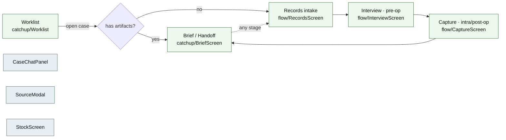

# The front-end (React SPA)

The full provider-facing app under [`ui/`](../ui/) — not a single review screen
but the whole workflow surface: a **worklist** of cases, **create-a-case**
intake, the three-stage **capture flow** (pre-op interview → intra-op memos →
post-op interview), the **brief/handoff** reader, plus an always-on **case-chat**
assistant and an **equipment stock** view. This doc is the *how* behind
[architecture.md §4](architecture.md): the screen state machine, the invariants
the UI holds, how a claim becomes a playable audio clip, and the view-model
layer that maps the API's `Case` onto every screen. The SPA is served from
`ui/dist` by the same FastAPI process that runs the pipeline, so one `uvicorn`
is the whole demo. *(A separate offline generator,
[`scripts/render_review.py`](../scripts/render_review.py), renders a static
per-case HTML review; this doc is the live app.)*

**The product.** PeriOp Companion documents one patient through three
perioperative stages, handed between providers who may never speak. Each stage's
note is assembled from **individually sourced claims**, and the UI's whole job is
to make that sourcing tangible and to walk a busy, non-technical clinician
through the workflow with no training. It is a reference tool on synthetic data —
no real patients, no login (a name/role picker records *who did this*, it is not
security).

## Screens & routing

No router, no store — routing is plain React state in
[`App.tsx`](../ui/src/app/App.tsx) (`View` = `worklist | case | stock`,
[App.tsx:52](../ui/src/app/App.tsx)), and a case's sub-screen is a second state
machine derived from case state by
[`flowScreen`](../ui/src/lib/flow.ts) ([flow.ts:73](../ui/src/lib/flow.ts)),
overridable by explicit navigation (`screenOverride`, [App.tsx:499](../ui/src/app/App.tsx)).

The flow screens are wrapped in [`FlowChrome`](../ui/src/components/flow/FlowChrome.tsx)
+ [`CaseSheet`](../ui/src/components/CaseSheet.tsx) (one centered sheet; regions
scroll, the page never does). The chat panel and the source modal are always-on
overlays while a case is open ([App.tsx:638](../ui/src/app/App.tsx)). Capture
differs by stage: **pre-/post-op is one interview** that auto-generates when the
transcript lands ([`autoGenerateReady`, flow.ts:52](../ui/src/lib/flow.ts));
**intra-op is accumulating voice memos** the provider generates explicitly
([RecordingPanel.tsx:149](../ui/src/components/flow/RecordingPanel.tsx)).

## The four invariants

These are load-bearing for the product, and each is enforced in code — preserve
them when you extend the UI.

1. **One primary action, always.** At every point exactly one button reads as
   "the thing to press next." It is computed, not hand-placed:
   [`primaryAction(case)`, workflow.ts:80](../ui/src/lib/workflow.ts) returns one
   of nine kinds (`add-records`, `review-questions`, `record-interview`,
   `record-memo`, `generate`, `generating`, `acknowledge-handoff`, `sign-off`) or
   `null` for a read-only demo case. Both the worklist and the brief action bar
   read it. A provider who only ever presses that button completes the workflow
   correctly.

2. **The provider is the gate.** A stage cannot generate until the prior one is
   signed off, and pre-op cannot generate until its gap-analysis questions are
   reviewed. **Sign-off** ([signoffStage, api.ts:117](../ui/src/lib/api.ts)) is a
   deliberate checkpoint that surfaces — never buries — a count of
   unsupported/conflicting/unresolved claims; on pre-op it also turns the ticked
   equipment suggestions into real reservations. **Reopen** is deliberately
   quieter than sign-off but never hidden.

3. **Claims are prose you cannot free-type over, but you can correct.** There is
   no rich-text editor. A provider may add or fix an individual claim
   ([addArtifactClaim / editArtifactClaim, api.ts:144](../ui/src/lib/api.ts)) —
   and that edit is registered as an attributed `edit:<provider_id>` source, so a
   human-asserted fact carries provenance exactly like a document chunk
   ([`record_human_edit`, schemas.py:333](../src/periop/schemas.py)). Provenance
   stays structural; the note never becomes a text box.

4. **Speech first, typing last.** The only required typing is a short case label;
   everything else is pasted, uploaded, or spoken
   ([`useRecorder`, recorder.ts:20](../ui/src/lib/recorder.ts) — a thin
   `MediaRecorder` that hands a `File` to the same upload path as a dropped
   file). Every screen opens with one plain-language sentence and its one action;
   errors say what to do next.

## Provenance, made tangible

Every claim renders as a short statement with a status badge and a dotted
**source link** ([`SourceLink`](../ui/src/components/SourceLink.tsx)). Clicking
it opens the [`SourceModal`](../ui/src/components/catchup/SourceModal.tsx), which
resolves the ref (`parseRef` splits `source_id#anchor` on the *final* `#`,
[provenance.ts:17](../ui/src/lib/provenance.ts)) and either scrolls to and
highlights the cited document chunk, or lights the cited transcript segment and
plays it. Audio playback is exact: [`AudioPlayer`](../ui/src/components/AudioPlayer.tsx)'s
`playClip(t0, t1)` ([:87](../ui/src/components/AudioPlayer.tsx)) seeks to `t0` and
**auto-pauses at `t1`** ([:116](../ui/src/components/AudioPlayer.tsx)); the
browser's native `<audio>` issues the byte-range requests to the Range-capable
audio route. [`provenance.ts`](../ui/src/lib/provenance.ts) also builds the
reverse index (which claims cite a source) — an unresolvable ref returns `null`,
never throws, because a broken citation is a *finding* the UI must show, not a
crash.

**The verification-status vocabulary** is the one place saturated colour earns
its keep. Five states ([`ClaimStatus`, schema.ts:9](../ui/src/lib/schema.ts)),
mapped once in [`CLAIM_STATUS_META`, catchup.ts:43](../ui/src/lib/catchup.ts) so
the ledger, sign-off, and stepper all agree:

| Glyph | Status | Token (`tailwind.config.js:46`) | Meaning |
|---|---|---|---|
| ✓ | supported | `status-supported` `#5f8a52` | span backs the claim |
| ○ | unsupported | `status-unsupported` `#8A6D1E` | cited, span doesn't establish it |
| ✕ | conflicting | `status-conflicting` `#A24B2E` | two spans disagree |
| → | inference | `status-inference` `#5E6E8A` | forward-looking, basis supported |
| ○ | unverified | `status-unverified` `#9a917f` | not yet checked |

A claim is **flagged** — needs a human's eyes before sign-off — when its status
is `conflicting`/`unsupported`/`unverified` **or** it cites nothing
([`claimFlagged`, claims.ts:17](../ui/src/lib/claims.ts)). Flagged and unresolved
claims are surfaced by default, never hidden — the trust pitch is that the tool
shows its work, including where the work is shaky. See
[provenance.md](provenance.md) for the backend guarantees behind
these states.

## The view-model layer ([`ui/src/lib/`](../ui/src/lib/))

The API returns a `Case`; a pure view-model layer maps it onto each screen so
components stay dumb.

| Module | Role |
|---|---|
| [api.ts](../ui/src/lib/api.ts) | axios REST; every response `.parse()`-d through zod at the boundary |
| [schema.ts](../ui/src/lib/schema.ts) | zod mirror of `periop.schemas`; field names match the pydantic models exactly |
| [sse.ts](../ui/src/lib/sse.ts) | stage-run / chat streaming via `fetch` + `ReadableStream` (`EventSource` can't POST) |
| [catchup.ts](../ui/src/lib/catchup.ts) | `buildBrief` → the brief/handoff view-model; worklist rows, key facts, theatre timeline, "needs you now" |
| [flow.ts](../ui/src/lib/flow.ts) | capture-flow state machine: which sub-screen, when auto-generate is ready, the chrome pills |
| [workflow.ts](../ui/src/lib/workflow.ts) | `primaryAction` (invariant 1) and default sub-screen landing |
| [claims.ts](../ui/src/lib/claims.ts) | the flagged-claim vocabulary shared across screens |
| [provenance.ts](../ui/src/lib/provenance.ts) | ref parse / resolve / reverse index |
| [recorder.ts](../ui/src/lib/recorder.ts) | `MediaRecorder` hook (invariant 4) |

## Theme & tokens

The visual language is set as **semantic tokens** in
[`tailwind.config.js`](../ui/tailwind.config.js) so component classes survive a
reskin — a single warm-paper theme: a paper canvas (`surface-base #FBF9F5`), a
muted-green brand accent (`brand #2F6B5E`) reserved for interactive elements, a
gold eyebrow accent, and the five-state status palette above. Type is serif
`Newsreader` for narrative prose, `Public Sans` for UI, and `IBM Plex Mono` for
the "raw sourced material" — identifiers, timestamps, transcript text. No
proprietary brand assets; icons are lucide-react. Tablet-width is the smallest
target (the intra-op record button is sized for arm's length); there is no
dark theme and no settings screen — nothing to configure.
