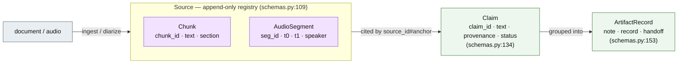

# Provenance & explainability

Every claim in every generated note carries provenance to a source-record chunk
or a timestamped, diarized audio segment. Provenance is **structural, not an
annotation**: notes are stored as sets of `Claim`s and the rendered document is
assembled *from* them ([schemas.py](../src/periop/schemas.py)), so a claim
cannot exist without a citation. This doc is the guarantee and where each half
of it lives in code; [architecture.md §3](architecture.md) has the wider data
model, [adk-orchestration.md](adk-orchestration.md) the generate→validate cell
these agents share.

## The chain

A **`ProvenanceRef`** ([schemas.py:48](../src/periop/schemas.py)) is the string
`source_id#anchor`, e.g. `audio:preop-interview#s017`. `.parse()` splits on the
**final** `#` (source ids contain colons) and rejects an empty half. A
**`Source`** ([:109](../src/periop/schemas.py)) is either a `DOCUMENT` holding
`Chunk`s or an `AUDIO` source holding `AudioSegment`s, each carrying
`(t0, t1, speaker)` — which is what lets the UI/CLI play the exact clip behind a
claim.

## Five guarantees

1. **Claim decomposition.** Each writer agent emits its note as atomic claims
   via structured output — never prose it later annotates. The writer's
   `WriterClaim` schema is `text` + `section` + `provenance[]`
   ([preop_note.py:29](../src/periop/agents/preop_note.py)); the shared
   [`structured_step`](../src/periop/adk/steps.py) loop enforces it.

2. **Citation validity at write time — two layers.** Writer `apply_fn`s drop a
   claim before committing if `provenance_resolves` is false, and that predicate
   is strict: a claim is dropped when it cites *nothing* **or** when *any one* of
   its refs fails to resolve ([context.py:45](../src/periop/agents/context.py),
   applied in [preop_note.py:101](../src/periop/agents/preop_note.py)). Behind
   it, `Case.add_artifact` is a hard backstop — it re-`resolve`s every ref and
   **raises** `ValueError` rather than commit a dangling citation
   ([schemas.py:371](../src/periop/schemas.py)). A hallucinated citation reaches
   no artifact.

3. **Independent verification.** `ClaimVerifier` re-checks each claim against
   *only* its cited spans, NLI-style, on the fast tier — the prompt is told to
   judge from the spans alone ([claim_verifier.py:23](../src/periop/agents/claim_verifier.py)).
   Verdicts are independent, so it fans out one verdict step per claim in
   `ParallelAgent` batches of width `PERIOP_VERIFIER_CONCURRENCY` (default 4;
   `0`/`1` = sequential), then writes each `claim.status` back **in place, in
   original ledger order — never dropping** ([verifier.py:146](../src/periop/adk/verifier.py)).
   Status is one of five ([`ClaimStatus`, schemas.py:29](../src/periop/schemas.py)):

   | | status | meaning |
   |---|---|---|
   | ✓ | `SUPPORTED` | spans back the claim |
   | ○ | `UNSUPPORTED` | cited, but the span doesn't establish it |
   | ✕ | `CONFLICTING` | two spans disagree |
   | → | `INFERENCE` | forward-looking risk whose *basis* is supported (verifier's `forward_looking` mode only, [claim_verifier.py:44](../src/periop/agents/claim_verifier.py)) |
   | ○ | `UNVERIFIED` | not yet checked |

   Flagged claims (`unsupported`/`conflicting`/`unverified`, or cited nowhere)
   are surfaced to the reviewer, never hidden — the same vocabulary the UI keys
   off ([frontend.md](frontend.md), `claims.ts`).

4. **Conflicts are first-class.** When records say X and the interview says Y,
   the note states the interview truth and cites it; the stale record value is
   not silently kept ([preop_note.py:62](../src/periop/agents/preop_note.py)),
   and gap analysis raises the disagreement as a `conflicting` question
   ([gap_analyst.py:23](../src/periop/agents/gap_analyst.py)). A human assertion
   becomes citable the same way any source is: `record_human_edit` registers it
   as an `edit:<provider_id>` document source
   ([schemas.py:333](../src/periop/schemas.py)).

5. **Composition, not generation, for the handoff.** The `HandoffComposer` may
   only select, order, and lightly rephrase existing signed-off claims. Each
   handoff item references source claims by global id `artifact_id#claim_id` and
   **inherits** their provenance; an item that inherits no real claim is dropped
   — no new fact enters ([handoff.py:83](../src/periop/agents/handoff.py)). This
   bounds hallucination in the highest-stakes artifact by construction.

## Process provenance

Content provenance says *where a fact came from*; process provenance says *which
agent, prompt, and model produced it*. Every LLM and tool call is wrapped in a
paired NAT OpenTelemetry step — `traced_llm_call` around each NIM completion
([telemetry.py:105](../src/periop/nat/telemetry.py), from
[nim.py:200](../src/periop/nim.py)) and `traced_tool_call` around the ASR leg —
so the profiler and the Langfuse exporter
([observability.py:61](../src/periop/nat/observability.py), opt-in on
`LANGFUSE_*` env) see the whole run. Off-loop steps (the stage runs in
`asyncio.to_thread`) marshal back onto the bound export loop so their spans keep
correct parentage. This is the "**ADK owns orchestration, NAT owns
observability**" split from [architecture.md](architecture.md).

## What this buys the evaluation

Because provenance is structural, the eval harness scores it directly
([metrics.py](../src/periop/evals/metrics.py)):

- **Provenance coverage** ([:36](../src/periop/evals/metrics.py)) — fraction of
  claims carrying ≥1 citation.
- **Provenance precision** ([:44](../src/periop/evals/metrics.py)) — of cited
  claims, the fraction the verifier marks `supported` or `inference`.
- **Hallucinated-claim rate** ([:58](../src/periop/evals/metrics.py)) — uncited
  or `unsupported`/`conflicting` claims; ≈0 for the HandoffComposer by
  construction (guarantee 5).
- **Claim recall** ([:182](../src/periop/evals/metrics.py)) — gold claims
  present, matched by an injected `matches(pred, gold)` predicate (LLM judge in
  prod, keyword stub in tests).
